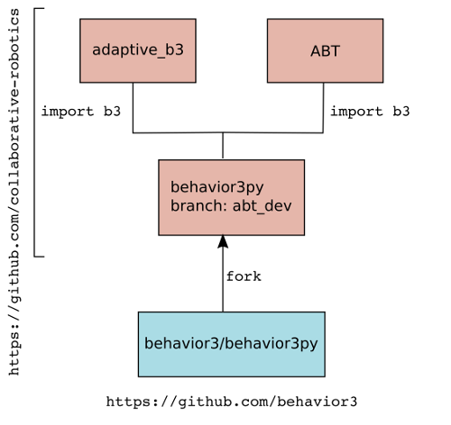

### ABT (Augmented Behavior Trees)

## Goals: 
 * simulate an ABT having stochastic output distribution for each leaf.
 * Use hmmlearn library to estimate stochastic ABT parameters from output data.
 * Support authoring of ABTs.
 * ABTs and related Hidden Markov Models are described in ["Hidden Markov Models derived from Behavior Trees"](https://arxiv.org/pdf/1907.10029.pdf)
 

 
## Classes:

The simulation is built on the [b3 library](https://github.com/collaborative-robotics/behavior3py) (a fork of 
[behavior3py](https://github.com/behavior3/behavior3py), as modified in the `abt_dev` [branch](https://github.com/collaborative-robotics/behavior3py/tree/abt_dev)   
a python Behavior Tree library.  The new leaf class, `aug_leaf(b3.Action)` inherits the 
b3 Action class and adds transition and emission probabilities.  

Emmisions (observations) from each state are modeled by `NSYMBOLS`  discrete symbols. 
There is a Gaussian probability density applied to each state with mean `mu` and standard deviation `sigma`.  The observations are integer valued.  Default sigma = 2.00.

"Perterbuation" refers to the process of changing the HMM parameters between generating model outputs
and running HMM-based analyses (e.g. Forward/Viterbi/Baum-Welch).   This is more realistic than starting out
with exact parameters.

## Setup:

To build a model you have to create three files (bad!)

1. `modelxx.py`.   This file contains/initializes
 
    1. The names of your ABT leafs,
    
    2. The initial probability of success for each leaf
    
    2. The mean and variance for the emission symbol distribution for each state
    
    2. all of this is folded into an object of class model() (def in abtclass.py)

2. `[ProjName]_ABT.py`.   This file sets up the ABT with 
 
    1. the new leaf class `aug_leaf()` (from abtclass.py)

    2. the 16-state file peg_ABT.py  e.g. peg in hole task. 
    
    **  or-** a simple test project:   `simp_ABT.py` with 4+2 states
    
    **  or-** customize your own `N` state model.
    
    3. ToDo: automatic generation of HMM from BT file


3. `top_level_hmm.py`.   This top-level file seqences the computational steps, typically:
 
    1. model setup
    
    1. simulated data generation
    
    1. HMM initialization
    
    1. HMM model fitting
    
    1. reporting

`tl_bw_hmm.py` has two command line arguments:   the HMM perturbation magnitude (0.0<p<0.5) and a text comment for the  metadata file. 
    
##  Output Files

Your results will appear in three files

1. `metadata.txt` -- one line for each run of tl_xxxxxxx.py. 
Unique filenames are generated using URI's.  Each line contains 
    
    1. date and time stamp
    1. name of data file
    2. ownname  (name of the top level file)
    3. git hash (1st 10 chars of current git hash) (for maximum provenance, be sure to commit prior to running
  your code).
    4. number of HMM / BT states
    5. text field (comment)

2. `sequences/`   contains the simulated state transition/observation sequences

3. `bw_output/`   containts datafiles (item 2 of metadata above).   Data file line:
    1.  Task code: (2=Baum Welch)
    1.  Ratio:  (codeword mean spacing / sigma)
    2.  di:     (codeword spacing)
    3.  HMM_delta:   amt HMM params changed
    4.  Sigma:    standard deviation of output observations in a state
    5.  run#
    6.  e2 (RMS error between original A matrix and identified A matrix)
    7.  emax (max error between original A matrix and identified A matrix )


## Other Files in this package

 * `hmm_bt.py`
 
    Utilities for A-matrices, and special magic for setting up an HMM_setup
    
 * `abtclass.py`

    The new "leaf" class which Augments the BT to work with Success/Fail probabilities, and stochastic observations from each leaf. 

## Testing:

 * Now unified with the python `unittest` library
 * To run all tests:
 ```
 > python2 -m unittest discover tests/
 ```
 * Tests now include a random.seed(integer) initialization for deterministic results. Both random and np.random seeds are initialized.  (note that there is still *some* variability though small. Maybe hmmlearn or other module deps rely on a third random number package. Also, some tests run differently when run as above vs individually as below!)
 
 * tests/test_seq_stats.py runs "correctly" as an individual test (below), but fails as part of the `unittest discover` command (above).   Not clear why yet. 
 
 * To run tests individually 
 ```
 > python2 -m unittest tests.XX_TEST_NAMEXX
 ```
 Important: use `.` instead of `/` and DO NOT add the `.py` extension to test name (complain to unittest developers etc).
    
## Based on 


# BEHAVIOR3PY

Behavior3 library, originally written in Javascript and converted to Python2.7

- Info: https://github.com/behavior3/behavior3py

- Based on the work of [(Marzinotto et al., 2014)](http://www.csc.kth.se/~miccol/Michele_Colledanchise/Publications_files/2013_ICRA_mcko.pdf), in which they propose a **formal**, **consistent** and **general** definition of Behavior Trees;


## [Wait!  I'm confused about these different BT repositories!](wait_im_confused.md)

